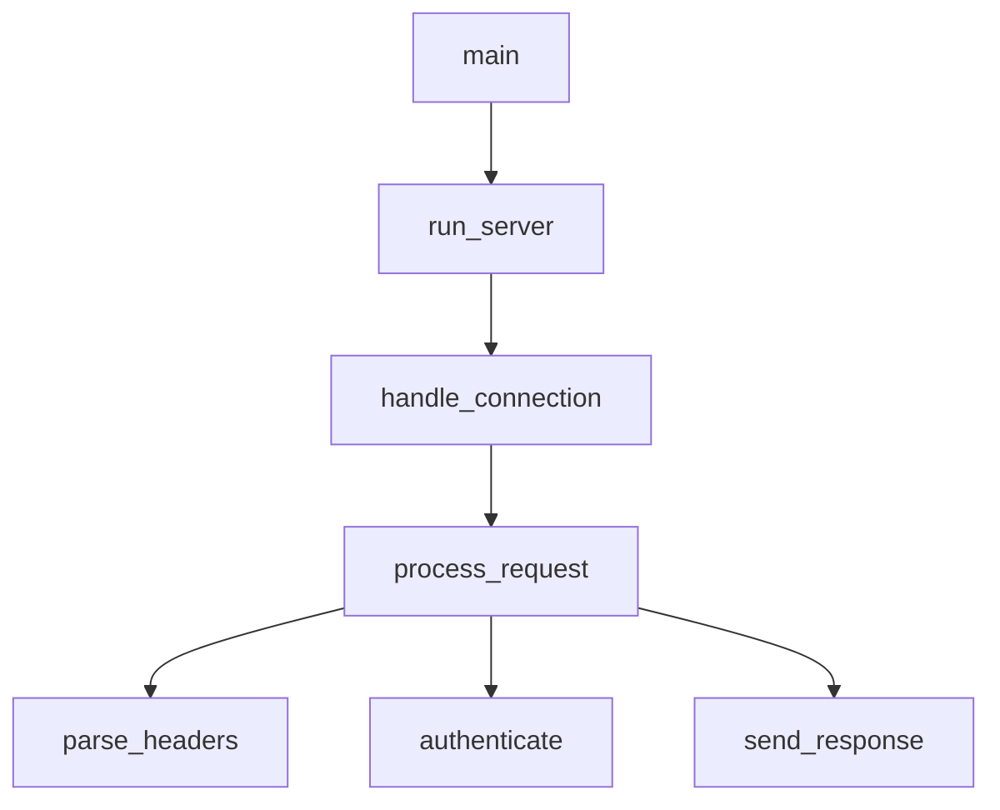

# Rust Call Graph

Visualize function call relationships using LSP call hierarchy.

## Usage

```
/rust-call-graph <function_name> [--depth N] [--direction in|out|both]
```

**Options:**
- `--depth N`: How many levels to traverse (default: 3)
- `--direction`: `in` (callers), `out` (callees), `both`

**Examples:**
- `/rust-call-graph process_request` - Show both callers and callees
- `/rust-call-graph handle_error --direction in` - Show only callers
- `/rust-call-graph main --direction out --depth 5` - Deep callee analysis

## LSP Operations

### 1. Prepare Call Hierarchy

Get the call hierarchy item for a function.

```
LSP(
  operation: "prepareCallHierarchy",
  filePath: "src/handler.rs",
  line: 45,
  character: 8
)
```

### 2. Incoming Calls (Who calls this?)

```
LSP(
  operation: "incomingCalls",
  filePath: "src/handler.rs",
  line: 45,
  character: 8
)
```

### 3. Outgoing Calls (What does this call?)

```
LSP(
  operation: "outgoingCalls",
  filePath: "src/handler.rs",
  line: 45,
  character: 8
)
```

## Workflow

```
User: "Show call graph for process_request"
    │
    ▼
[1] Find function location
    LSP(workspaceSymbol) or Grep
    │
    ▼
[2] Prepare call hierarchy
    LSP(prepareCallHierarchy)
    │
    ▼
[3] Get incoming calls (callers)
    LSP(incomingCalls)
    │
    ▼
[4] Get outgoing calls (callees)
    LSP(outgoingCalls)
    │
    ▼
[5] Recursively expand to depth N
    │
    ▼
[6] Generate ASCII visualization
```

## Output Format

### Incoming Calls (Who calls this?)

```
## Callers of `process_request`

main
└── run_server
    └── handle_connection
        └── process_request  ◄── YOU ARE HERE
```

### Outgoing Calls (What does this call?)

```
## Callees of `process_request`

process_request  ◄── YOU ARE HERE
├── parse_headers
│   └── validate_header
├── authenticate
│   ├── check_token
│   └── load_user
├── execute_handler
│   └── [dynamic dispatch]
└── send_response
    └── serialize_body
```

### Bidirectional (Both)

```
## Call Graph for `process_request`

                    ┌─────────────────┐
                    │      main       │
                    └────────┬────────┘
                             │
                    ┌────────▼────────┐
                    │   run_server    │
                    └────────┬────────┘
                             │
                    ┌────────▼────────┐
                    │handle_connection│
                    └────────┬────────┘
                             │
        ┌────────────────────┼────────────────────┐
        │                    │                    │
┌───────▼───────┐   ┌───────▼───────┐   ┌───────▼───────┐
│ parse_headers │   │ authenticate  │   │send_response  │
└───────────────┘   └───────┬───────┘   └───────────────┘
                            │
                    ┌───────┴───────┐
                    │               │
             ┌──────▼──────┐ ┌──────▼──────┐
             │ check_token │ │  load_user  │
             └─────────────┘ └─────────────┘
```

## Analysis Insights

After generating the call graph, provide insights:

```
## Analysis

**Entry Points:** main, test_process_request
**Leaf Functions:** validate_header, serialize_body
**Hot Path:** main → run_server → handle_connection → process_request
**Complexity:** 12 functions, 3 levels deep

**Potential Issues:**
- `authenticate` has high fan-out (4 callees)
- `process_request` is called from 3 places (consider if this is intentional)
```

## Common Patterns

| User Says | Direction | Use Case |
|-----------|-----------|----------|
| "Who calls X?" | incoming | Impact analysis |
| "What does X call?" | outgoing | Understanding implementation |
| "Show call graph" | both | Full picture |
| "Trace from main to X" | outgoing | Execution path |

## Visualization Options

| Style | Best For |
|-------|----------|
| Tree (default) | Simple hierarchies |
| Box diagram | Complex relationships |
| Flat list | Many connections |
| Mermaid | Export to docs |

### Mermaid Export



## Related Skills

| When | See |
|------|-----|
| Find definition | rust-code-navigator |
| Project structure | rust-symbol-analyzer |
| Trait implementations | rust-trait-explorer |
| Safe refactoring | rust-refactor-helper |
